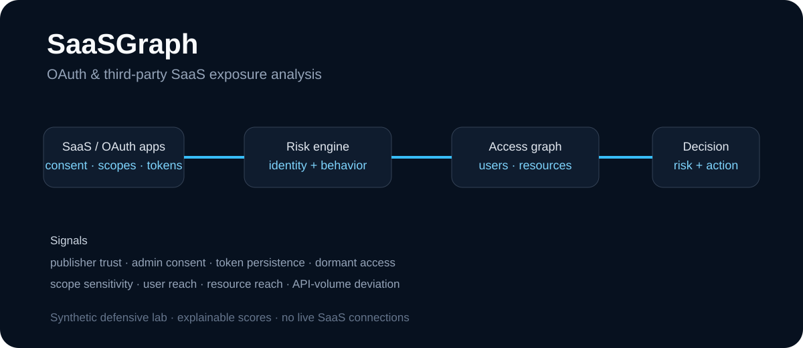
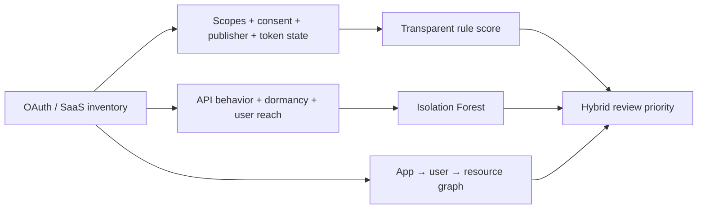

<div align="center">

# SaaSGraph

### OAuth & Third-Party SaaS Exposure · Hybrid Behavioral ML

**A defensive SaaS-security workbench that combines explainable OAuth policy, behavioral anomaly detection, and application-to-user-to-resource blast-radius analysis.**

[](https://github.com/VinayK88/SaaSGraph/actions/workflows/ci.yml)
[](https://www.python.org/)
[](#hybrid-behavioral-ml)
[](#overview)

**OAuth scopes · consent · token persistence · Isolation Forest · API anomalies · access graphs · blast radius**

</div>

---



## Overview

SaaSGraph answers two related questions:

> **If a third-party application or OAuth token is abused, what can it actually reach?**

> **Does this integration look unusual compared with a normal SaaS/OAuth reference population?**

The deterministic security engine and ML layer remain separate and explainable.



## Synthetic baseline

The public fixture contains 8 deterministic synthetic OAuth applications.

| Measure | Baseline |
| --- | ---: |
| Applications | **8** |
| Expected rule outcomes matched | **8 / 8** |
| Critical | **2** |
| High risk | **2** |
| Review | **2** |
| Normal | **2** |
| Mean deterministic risk | **50.5 / 100** |
| Users behind high-risk / critical grants | **771** |
| Highest deterministic risk | **AnalyticsSync — 100 / 100** |

These values are synthetic implementation evidence, not measurements from a production SaaS tenant.

## Hybrid behavioral ML

SaaSGraph now uses **Isolation Forest** over 11 OAuth/SaaS posture and behavior features:

```text
scope risk
scope count
sensitive scope count
user reach
persistent token
application dormancy
observed / baseline API ratio
resource reach
publisher verification
admin consent
external-tenant boundary
```

The model is fit against **800 deterministic synthetic normal-reference profiles** generated with a fixed seed.

For each application it returns:

- `anomaly_percentile` — unusualness relative to the synthetic normal reference;
- `ml_outlier` — Isolation Forest outlier state;
- `top_deviations` — strongest feature deviations from the normal reference;
- `hybrid_priority` — deterministic OAuth risk plus a bounded ML adjustment.

The existing rule score remains visible and authoritative for explicit policy findings. The anomaly percentile is **not a probability of compromise**.

Detailed methodology: [`docs/ml-anomaly-model.md`](docs/ml-anomaly-model.md).

## Why rules + ML?

OAuth posture contains facts that should remain deterministic:

- sensitive scopes;
- administrative consent;
- publisher verification;
- persistent refresh-token access;
- cross-tenant trust;
- dormancy.

ML adds value when the *combination* of access and behavior is unusual, particularly when current API activity differs sharply from ordinary application behavior.

```text
OAuth policy evidence
        +
Behavioral anomaly score
        +
Graph blast radius
        ↓
Explainable review priority
```

## Deterministic OAuth risk model

The transparent rule engine still scores:

```text
scope sensitivity
publisher trust
admin consent
token persistence
user reach
dormancy
API-volume deviation
resource reach
cross-tenant exposure
high-risk interactions
```

It returns:

```text
NORMAL / REVIEW / HIGH_RISK / CRITICAL
```

Representative synthetic applications include `AnalyticsSync`, `MigrationAssistant`, `SupportTools`, `LegacyExport`, `BuildBot`, `PayrollConnector`, `NotesLite`, and `CalendarHelper`.

## OAuth blast radius

SaaSGraph models access as a relationship rather than a flat permission list:

```text
Third-party application
      ├── OAuth scopes
      ├── authorized users
      ├── persistent token
      └── SaaS resources
                ↓
          blast radius
```

For example, a broad file-reading integration may connect one publisher to hundreds of users and several downstream data systems. The graph layer makes that reach explicit while the ML layer evaluates whether the integration's posture and behavior are unusual.

## Report output

The CLI now includes both deterministic and ML evidence:

```json
{
  "summary": {
    "applications": 8,
    "expected_outcomes_matched": 8
  },
  "ml": {
    "model": "IsolationForest",
    "normal_reference_samples": 800,
    "features": ["..."]
  },
  "ml_findings": [
    {
      "app_id": "app-...",
      "rule_score": 0,
      "anomaly_percentile": 0.0,
      "hybrid_priority": 0,
      "top_deviations": ["..."]
    }
  ]
}
```

The ML values above are schematic field examples; executable values are generated from the checked-in synthetic fixtures.

## API & dashboard

```bash
pip install -e '.[api]'
uvicorn saasgraph.api:app --reload
```

Endpoints:

```text
GET /healthz
GET /report
GET /apps
GET /apps/{app_id}
GET /docs
```

## Quick start

```bash
git clone https://github.com/VinayK88/SaaSGraph.git
cd SaaSGraph
python -m venv .venv
source .venv/bin/activate
pip install -e '.[api]'
saasgraph
python -m unittest discover -s tests -v
uvicorn saasgraph.api:app --reload
```

Docker:

```bash
docker build -t saasgraph .
docker run --rm -p 8000:8000 saasgraph
```

## Portfolio distinction

```text
BrowserGuard → browser/extension behavioral anomaly detection
AgentAtlas   → AI-agent identity/posture anomaly + peer deviation
DeepTrace    → NLP narrative clustering with TF-IDF + DBSCAN
SaaSGraph    → OAuth/SaaS behavioral anomaly + consent/access graph
```

## Evaluation boundary

Everything in this repository is synthetic and defensive. SaaSGraph does not authenticate to real tenants, retrieve refresh tokens, enumerate private user data, revoke applications, or change consent.

The deterministic score and ML anomaly percentile are prioritization aids, not breach probabilities. Production use would require authorized tenant telemetry, role-aware peer groups, model/feature drift monitoring, analyst feedback, calibrated thresholds, and auditable response workflows.
