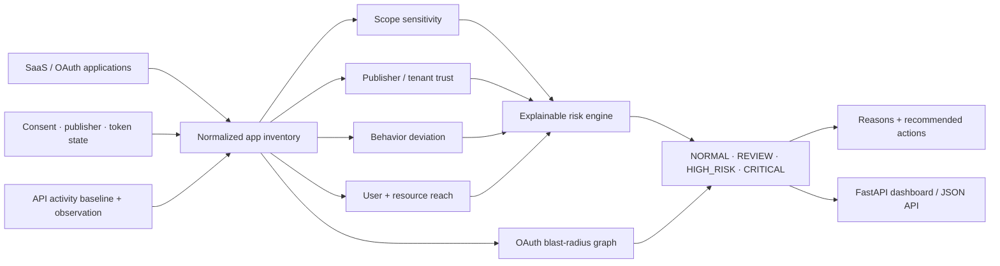
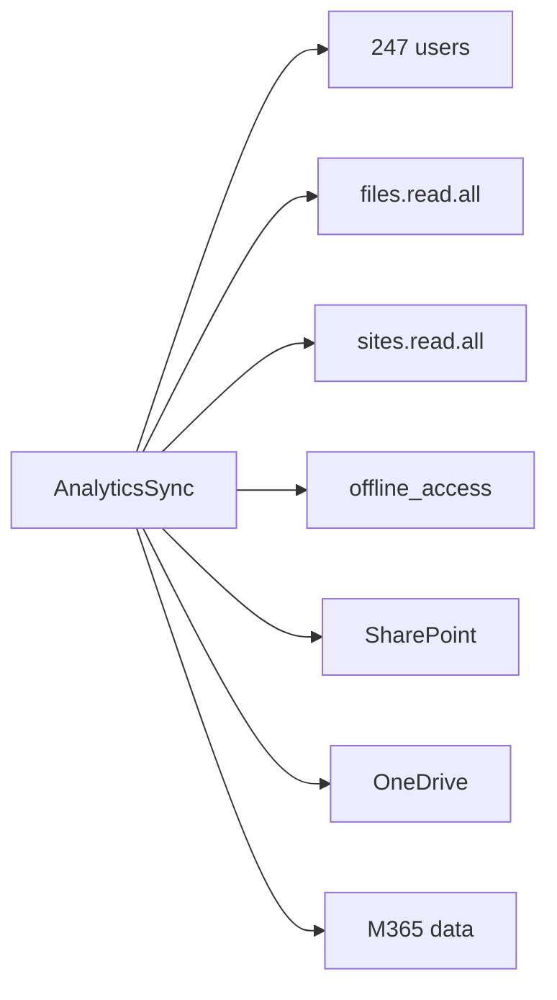

<div align="center">

# SaaSGraph

### OAuth & Third-Party SaaS Exposure Analysis

**A defensive security workbench for discovering risky SaaS integrations, explaining OAuth consent exposure, measuring token and permission blast radius, and prioritizing third-party application risk.**

[](https://github.com/VinayK88/SaaSGraph/actions/workflows/ci.yml)
[](https://www.python.org/)
[](#what-saasgraph-is-used-for)
[](#oauth-blast-radius)
[](#security--evaluation-boundary)

**Consent risk · OAuth scopes · token persistence · publisher trust · API anomalies · access graphs · blast radius**

[Overview](#overview) · [Evidence](#baseline-evidence) · [Architecture](#architecture) · [Risk Model](#risk-model) · [API](#api--dashboard) · [Quick Start](#quick-start)

</div>

---


## Overview

SaaSGraph is built around a simple security question:

> **If a third-party application or OAuth token is abused, what can it actually reach?**

Modern SaaS environments accumulate integrations that may have broad scopes, persistent refresh tokens, administrative consent, large user populations, cross-tenant trust, or access that remains long after the application stops being actively used.

SaaSGraph turns those relationships into an explainable **application → permission → user → resource** exposure model.

```text
Third-party application
        │
        ├── publisher trust
        ├── OAuth scopes
        ├── admin consent
        ├── refresh-token persistence
        ├── authorized users
        ├── SaaS resources
        ├── inactivity / dormancy
        └── observed API behavior
                  │
                  ▼
             SaaSGraph
                  │
        ┌─────────┼──────────┐
        ▼         ▼          ▼
   Risk score   Reasons   Blast radius
        │         │          │
        └─────────┼──────────┘
                  ▼
     NORMAL / REVIEW / HIGH_RISK / CRITICAL
```

The project deliberately separates **configuration exposure** from **behavioral evidence**. A broad permission grant matters, but the same grant becomes much more urgent when combined with persistent access, an unverified publisher, tenant-wide consent, or a sudden API-volume spike.

---

## What SaaSGraph is used for

| Use case | Defensive question |
| --- | --- |
| **OAuth consent review** | Which applications have broad or sensitive scopes and who approved them? |
| **Third-party SaaS risk** | Which external publishers can reach sensitive enterprise resources? |
| **Token persistence review** | Which applications retain long-lived access even after normal user authentication changes? |
| **Dormant-app cleanup** | Which integrations are inactive but still retain permissions? |
| **SaaS blast-radius analysis** | How many users and resources sit behind a single third-party trust relationship? |
| **Behavior anomaly triage** | Is current API activity materially different from the application's normal baseline? |
| **Admin-consent governance** | Which applications combine administrative consent with sensitive permissions? |
| **Incident prioritization** | Which grants should be investigated or revoked first when token abuse is suspected? |

### Intended users

SaaSGraph is designed for **cloud-security teams, identity/IAM teams, SaaS-security programs, SOC analysts, incident responders, security architects, and third-party risk teams** that need to reason about application access rather than only user accounts.

---

## 60-second reviewer path

1. Review the [baseline evidence](#baseline-evidence).
2. Follow the [architecture](#architecture) and [OAuth blast-radius](#oauth-blast-radius) model.
3. Inspect the [risk model](#risk-model) and example critical finding.
4. Run the deterministic CLI and tests from [Quick Start](#quick-start).
5. Open the FastAPI dashboard or inspect the machine-readable API output.

---

## Baseline evidence

The repository contains **8 deterministic synthetic SaaS/OAuth applications** spanning benign, review-worthy, high-risk, and critical patterns.

| Measure | Current baseline |
| --- | ---: |
| Applications evaluated | **8** |
| Expected outcomes matched | **8 / 8** |
| Critical | **2** |
| High risk | **2** |
| Review | **2** |
| Normal | **2** |
| Mean risk score | **50.5 / 100** |
| Users behind high-risk or critical grants | **771** |
| Highest-risk application | **AnalyticsSync — 100 / 100** |
| Unit tests | **8 / 8 passing locally** |

The checked-in report is [`reports/baseline.json`](reports/baseline.json).

> These numbers are **synthetic project evidence**. They verify the implementation and decision logic; they are not measurements from a real Microsoft 365, Google Workspace, GitHub, Slack, Salesforce, or other SaaS tenant.

### Synthetic application outcomes

| Application | Pattern | Risk |
| --- | --- | ---: |
| `AnalyticsSync` | unverified publisher + admin consent + broad file scopes + persistent token + extreme API spike | **CRITICAL · 100** |
| `DataMover` | broad file/mail access + admin consent + persistent token + large user reach + high API deviation | **CRITICAL · 78** |
| `Acme Support Tools` | unverified external app + mail/contacts access + persistent token + API spike | **HIGH_RISK · 61** |
| `LegacyExport` | dormant admin-consented directory integration retaining persistent access | **HIGH_RISK · 53** |
| `BuildBot` | admin-consented engineering integration with persistent access | **REVIEW · 40** |
| `PayrollConnector` | verified but persistent admin-consented business integration | **REVIEW · 35** |
| `NotesLite` | small external app with low-sensitivity access | **NORMAL · 16** |
| `CalendarHelper` | verified, narrow, non-persistent access | **NORMAL · 9** |

---

## Architecture



### Why a graph matters

A SaaS application is not only a configuration object. It is a **trust relationship** connecting a publisher to users, permissions, and data systems.

```text
AnalyticsSync
      │
      ├── admin consent
      ├── offline_access
      ├── files.read.all
      ├── sites.read.all
      │
      ├── 247 authorized users
      │
      ├── SharePoint
      ├── OneDrive
      └── Microsoft 365 data
```

That relationship has a larger security consequence than any individual scope viewed in isolation.

---

## Risk model

SaaSGraph uses a transparent deterministic score rather than pretending to produce a calibrated breach probability.

```text
risk =
    scope sensitivity
  + publisher trust risk
  + admin-consent exposure
  + token persistence
  + user reach
  + dormancy
  + API-volume deviation
  + resource reach
  + cross-tenant exposure
  + high-risk interaction adjustments
```

### Signals

| Signal | Why it matters |
| --- | --- |
| **Sensitive scopes** | Mail, files, directories, sites and repositories can expose high-value data. |
| **Administrative consent** | One approval may create broad organization-level reach. |
| **Publisher verification** | Unknown or unverified publishers increase trust uncertainty. |
| **Persistent token access** | Access can outlive an interactive session and may remain valuable to an attacker. |
| **User reach** | A single integration affecting hundreds of users creates concentrated exposure. |
| **Dormancy** | Unused applications can become forgotten standing access. |
| **API deviation** | Sudden bulk activity can raise the priority of an otherwise known application. |
| **Cross-tenant trust** | External ownership increases the number of security boundaries involved. |

### Decision states

| Decision | Meaning |
| --- | --- |
| `NORMAL` | Current synthetic evidence is low priority. |
| `REVIEW` | The grant deserves periodic or owner review. |
| `HIGH_RISK` | Multiple material risk signals require prioritized investigation. |
| `CRITICAL` | The combination of permissions, persistence, reach, trust and/or activity supports immediate investigation. |

---

## OAuth blast radius

The blast-radius layer makes the exposure concrete.



For the synthetic `AnalyticsSync` fixture:

```text
Application node             1
Authorized users           247
Reachable SaaS resources     3
Graph nodes                251
Graph edges                253
API activity vs baseline  153.5x
```

The implementation is intentionally simple enough to audit. A production graph could expand groups, service principals, application roles, nested SaaS integrations, resource sensitivity, token/session provenance, and downstream third-party processors.

---

## Example critical finding

```text
SAASGRAPH FINDING

Application              AnalyticsSync
Publisher                DataWorks Labs
Publisher verified       NO
Admin consent            YES
Persistent token         YES
Authorized users         247

Scopes
- files.read.all
- sites.read.all
- offline_access

Resources
- SharePoint
- OneDrive
- Microsoft 365

API baseline             120 calls / hour
Observed                 18,420 calls / hour
Deviation                153.5x

Risk                     CRITICAL
Score                    100 / 100

Why
- broad or sensitive OAuth scopes
- publisher is not verified
- tenant-wide or administrative consent
- persistent refresh-token access
- extreme API-volume deviation from baseline
- third-party tenant trust boundary
- high-risk consent and persistence combination
```

This is stronger than a generic “OAuth app is risky” alert because the evidence is broken into independent, reviewable reasons.

---

## Input → output example

Request:

```text
GET /apps/app-002
```

Representative output from the executable fixture:

```json
{
  "assessment": {
    "app_id": "app-002",
    "name": "AnalyticsSync",
    "risk_level": "CRITICAL",
    "risk_score": 100,
    "scope_risk": 26,
    "api_ratio": 153.5,
    "users_exposed": 247,
    "resources_reachable": 3,
    "reasons": [
      "broad or sensitive OAuth scopes",
      "publisher is not verified",
      "tenant-wide or administrative consent",
      "persistent refresh-token access",
      "extreme API-volume deviation from baseline",
      "third-party tenant trust boundary",
      "high-risk consent and persistence combination"
    ]
  },
  "blast_radius": {
    "users": 247,
    "resources": ["sharepoint", "onedrive", "m365"],
    "nodes": 251,
    "edges": 253
  }
}
```

---

## API & dashboard

SaaSGraph includes a lightweight FastAPI service and dark security dashboard.

```bash
pip install -e '.[api]'
uvicorn saasgraph.api:app --reload
```

Open:

```text
http://127.0.0.1:8000
```

Endpoints:

```text
GET /healthz
GET /report
GET /apps
GET /apps/{app_id}
GET /docs
```

The dashboard surfaces application counts, critical/high-risk totals, mean risk, user exposure, API deviation and per-application decisions.

---

## Engineering & quality

| Area | Implementation |
| --- | --- |
| Domain model | Typed Python dataclasses |
| Risk logic | Dependency-free deterministic engine |
| Permission model | Weighted OAuth scope sensitivity |
| Behavior layer | Per-app API baseline deviation |
| Graph layer | User, resource and scope blast-radius representation |
| Explainability | Reason codes + recommended actions |
| Interface | CLI + FastAPI dashboard/API |
| Evidence | Checked-in deterministic baseline JSON |
| Deployment | Dockerfile |
| Quality | Unit tests + Python 3.10–3.12 CI |

---

## Quick start

```bash
git clone https://github.com/VinayK88/SaaSGraph.git
cd SaaSGraph

python -m venv .venv
source .venv/bin/activate
pip install -e '.[api]'

# Generate the synthetic exposure report
saasgraph

# Run tests
python -m unittest discover -s tests -v

# Start the dashboard / API
uvicorn saasgraph.api:app --reload
```

Docker:

```bash
docker build -t saasgraph .
docker run --rm -p 8000:8000 saasgraph
```

---

## Repository map

```text
SaaSGraph/
├── saasgraph/
│   ├── models.py       # OAuth application and assessment models
│   ├── fixtures.py     # deterministic synthetic SaaS inventory
│   ├── engine.py       # risk scoring + blast radius
│   ├── report.py       # baseline evidence assembly
│   ├── api.py          # FastAPI dashboard / API
│   └── cli.py          # command-line report output
├── assets/
│   └── saasgraph-overview.svg
├── docs/
│   └── methodology.md
├── reports/
│   └── baseline.json
├── tests/
│   └── test_engine.py
├── .github/workflows/
│   └── ci.yml
├── Dockerfile
├── SECURITY.md
└── README.md
```

---

## How this differs from adjacent projects

```text
AgentAtlas
    → What can AI agents and delegated identities access?

AttackPath AI
    → How can a compromise propagate across identity, cloud and SaaS?

CloudRescue
    → Can critical cloud workloads recover after compromise?

SaaSGraph
    → Which third-party OAuth/SaaS trust relationships expose enterprise data?
```

SaaSGraph therefore owns a separate portfolio category: **SaaS security, OAuth governance, consent risk and third-party application exposure**.

---

## Production evolution

A production version would replace synthetic fixtures with authorized read-only evidence from supported identity and SaaS providers, including:

- enterprise application and service-principal inventory;
- user and administrative consent grants;
- OAuth scope / app-role assignments;
- publisher and tenant provenance;
- token and session metadata where legally and technically appropriate;
- app sign-in and API activity;
- resource sensitivity and data classification;
- user/group expansion;
- application owners and business justification;
- historical permission changes;
- approved app catalog / allowlist state;
- incident-response and revocation workflows; and
- auditable human approval for access-changing actions.

The next technical step would be to add **provider adapters behind a common evidence interface** while preserving the current explainable decision contract.

---

## Security & evaluation boundary

**Everything in this repository is synthetic and defensive.**

SaaSGraph does not authenticate to production tenants, collect credentials, retrieve real refresh tokens, enumerate private user data, revoke applications, modify consent, or execute destructive response actions.

All application names, user counts, scopes, activity levels, and resource relationships in the baseline are invented for deterministic evaluation.

The risk score is an engineering heuristic—not a breach probability, compliance score, certification, or vendor security rating.

See [`SECURITY.md`](SECURITY.md) and [`docs/methodology.md`](docs/methodology.md).

---

<div align="center">

### OAuth access is a trust graph, not just a permission list.

**SaaS Security · OAuth Governance · Identity Risk · Third-Party Exposure · Security Analytics**

</div>
